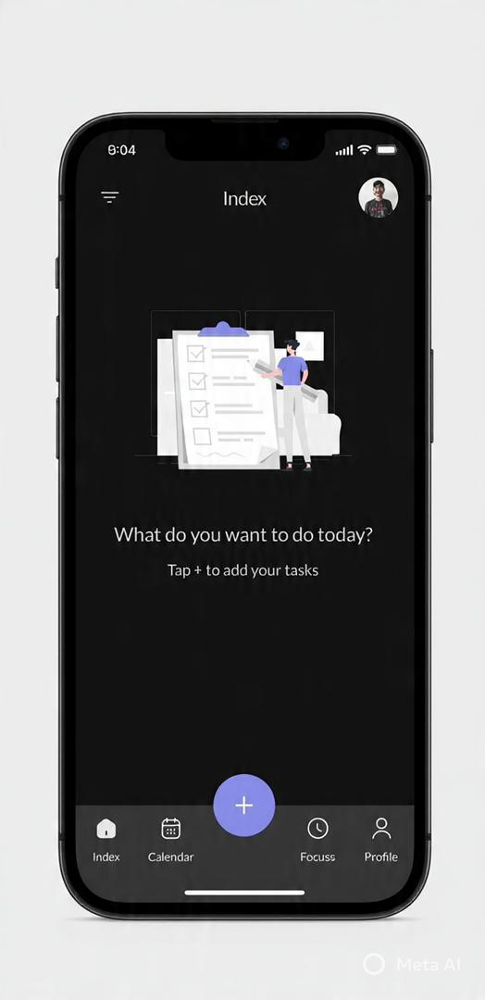
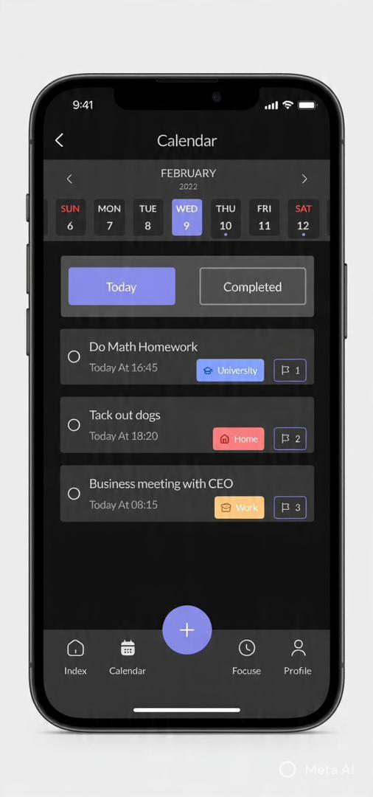

# Doova 📝

Doova is a task management application built with Flutter and Firebase.

The app allows users to create, manage, and organize tasks efficiently with a clean and responsive user interface.

## Tech Stack
- Flutter (Mobile)
- Firebase (Auth,Backend)
- Dart
- 
## 📸 Screenshots

  
  
  
  

## Purpose
This project was built after graduating from mobile tech school as a practical way to apply real-world Flutter and Firebase concepts.

## Status
🚧 Actively improving and open to feedback.
